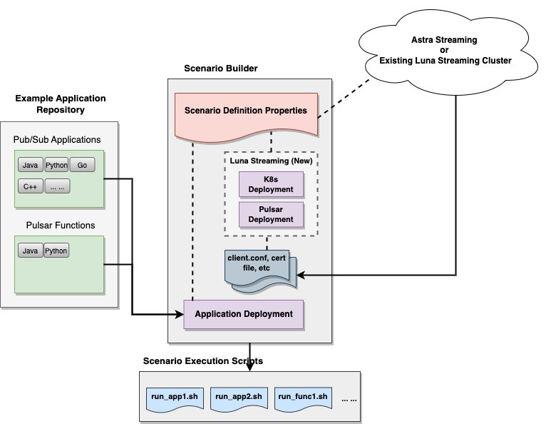

# 1. Overview

This repository is intended to make it super easy for people to learn and use Apache Pulsar to satisfy a variety of common messaging and streaming processing needs. Based on our experiences, we find out that there are several common challenges that keep showing up for Pulsar customers, especially when they are new to Pulsar and/or don't have much hands-on Pulsar operation experience. These challenges are:

1. Setting up and configuring a Pulsar cluster properly can be challenging. Although DataStax Astra Streaming offers an as-a-service solution to make it lot easier to use Apache Pulsar, it is not rare that a customer wants to set up and manage a Pulsar cluster on their own.
   
2. Apache Pulsar is a powerful, unified messaging and streaming processing system that can be used as a drop-in replacement of many existing messaging and streaming processing systems such as JMS, Kafka, and RabbitMQ. But since Pulsar is a relatively new technology and also fast-growing at the same time, there are not many application examples to showcase how to use Pulsar properly to achieve these goals.

3. When it comes to some common messaging and streaming processing scenarios, the typical end-to-end workflows of using Pulsar to address the challenges in these scenarios are not always clear to Pulsar newcomers. 

The `reusable Pulsar POC framework`, as what we call for the work presented in this repository, is designed to address the above challenges.

#  2. Framework Structure

The diagram below shows how the high level structure of this framework.

In the above structure, there are two major components:

1. An example application repository that include both messaging producing/consuming client applications and Pulsar functions.
   
2. A "demonstration scenario (or simply **scenario**)" builder. You define a scenario via a property file (*scenario definition file*) which has the following information:
   * The underlying Pulsar infrastructure to use. This can be 
      * A brand new Luna Streaming cluster, or
      * An Astra Streaming cluster or an existing Luna Streaming/OSS Pulsar cluster.
   * The example applications to be included in this scenario

Based on the settings in the *scenario definition file*, the scenario builder will take the following steps in sequence:

1. If the chosen Pulsar infrastructure is Astra Streaming or an existing Pulsar cluster, it reminds you to download or prepare the correct files (e.g. `client.conf`, the trusted ca certificate for TLS connection) in the right folder. Then skip the next two steps and jump to *step 4*.

2. (For new Luna Streaming Cluster only) Create a K8s cluster of your choice (currently supports `Kind`, `GKE`, `EKS`, and `AKS`).
   
3. (For new Luna Streaming Cluster only) Create a Pulsar cluster in the previously created K8s cluster. 
   * This Pulsar cluster has Starlight for Kafka (S4K) and Starlight for RabbitMQ (S4R) enabled by default
   * You also have the option to choose what Pulsar security features to enable: authentication, authorization, and TLS encryption

4. Based on the **application deployment** requirement in the scenario definition file, the scenario builder will pick the right applications from the example application repository and generate corresponding execution scripts.

---

**NOTE**: For more details about the scenario definition, including **application deployment**, please see the doc of [Understand Demonstration Scenarios](understand_scenario.md)) 