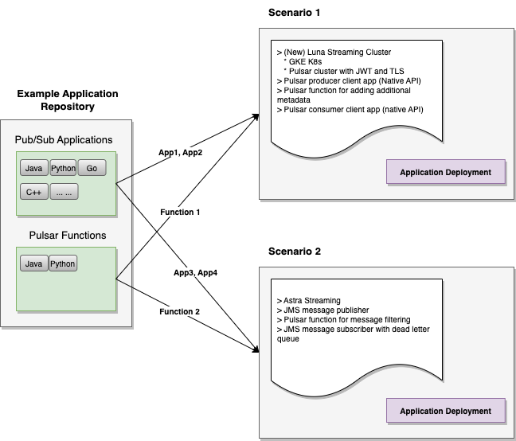

# 1. Define a Scenario

As we explained in the overall structure document, this framework is designed around *demonstration scenarios* (or simply `scenarios`). The diagram below shows how this design works with the mindset in place that the example applications in the repository can be reused in different scenarios.



Basically, through a simple configuration file, you define a scenario with the following information

* What is the Pulsar environment to run the scenario (*infrastructure mode*)? It can be one of the following 3 options:
   * Use Astra Streaming (`astra`),
   * Use an existing Pulsar cluster (`luna-existing`), or 
   * Create a new Luna Streaming cluster (`luna-new`)

* What are the example applications you want to include in this scenario, so you can showcase certain messaging and streaming processing capabilities.

## 1.1. File Structure of Defining a Scenario

All defined scenarios are organized under the `scenarios` folder, an example is as below:

```
scenarios/
├── message-e2e-enrich
│   ├── post_deploy.sh
│   └── scenario.properties
│
├── ... 
```

In order to create a new *scenario*, create a subfolder under `scnearios` and the subfolder name will be the scenario name to be used when running the scenario deployment script.

1. You must create a text file named `scenario.properties` in the scenario subfolder. In this file, you defined the required scenario information as explained above.

2. Optionally, you can have a script file `post_deploy.sh` where you can put extra logic that need to be executed automatically as the last step of the scenario deployment script execution. This is normally desired to run some preparation tasks before running actual example applications included in this scenario. For example, you can use this script to create the required Pulsar namespaces, topics, etc.

# 2. Deploy a Scenario

Once you have a scenario created, you can deploy it by running the following script:
 
* `scenarios/deployScenario.sh -scnname <scenario_name>`

This deployment script has other parameters as illustrated below and their meanings should be straightforward from the command line descriptions.
```
Usage: deployScenario.sh [-h]
                         -scnName <scenario_name>
                         [-scnPropFile] <scenario_property_file>
                         [-depAppOnly]
                         [-rebuildApp]
                         [-appDefFile] <app_definition_file>
                         [-k8sClstrName] <k8s_cluster_name>
                         [-k8sPropFile] <k8s_property_file>
                         [-pulsarClstrName] <pulsar_cluster_name>
                         [-pulsarPropFile] <pulsar_property_file>

       -h              : Show usage info
       -scnName        : Demo scenario name.
       -scnPropFile    : (Optional) Full file path to a scenario property file. Use default if not specified.
       -depAppOnly     : (Optional) Skip infrastructure deployment and only deploy applications.
       -rebuildApp     : (Optional) Whether to rebuild the application repository.
       -appDefFile     : (Optional) Full file path to an application definition file.
 ----------------------------------------------------------------------------------
 The following options are only relevant when 
   scenario.infra_mode=='luna_new'. Otherwise, they're no-op even if specified!
 ----------------------------------------------------------------------------------
       -k8sClstrName   : (Optional) K8s cluster name. Use default if not specified.
       -k8sPropFile    : (Optional) Full file path to a K8s deployment property file. Use default if not specified.
       -pulsarClstrName: (Optional) Pulsar cluster name. Use default if not specified.
       -pulsarPropFile : (Optional) Full file path to a Pulsar deployment property file. Use default if not specified.
```

## 2.1. Infrastructure Deployment 

When the infrastructure mode of a scenario is defined as `luna_new`, this means to create a new K8s based Luna Streaming Pulsar cluster. The scenario deployment script will also take care of the deploying a K8s cluster and a Pulsar cluster on top of it.

### 2.1.1. K8s Deployment

Regarding the K8s deployment, this framework currently supports deploying a K8s cluster in the following ways:
* A local, `kind` based, multi-node K8s cluster (see [this doc](../cluster_deploy/k8s/kind/README.md) for more details).
* A `GKE` k8s cluster on Google Cloud (see [this doc](../cluster_deploy/k8s/gke/README.md) for more details).
* A `EKS` k8s cluster on AWS Cloud (see [this doc](../cluster_deploy/k8s/eks/README.md) for more details).
* A `AKS` k8s cluster on Azure Cloud (see [this doc](../cluster_deploy/k8s/eks/README.md) for more details).

The K8s deployment can be customized (in a certain degree) by providing a configuration based *K8s deployment property file*: 
* A default one is available at: [k8s.properties](../cluster_deploy/k8s/k8s.properties)
* You can override the default one by providing your own version K8s deployment property file.

### 2.1.2. Pulsar Deployment

The framework will also deploy a Pulsar cluster on the previously created K8s cluster using DataStax Pulsar helm chart. 

The Pulsar deployment can be also customized (in a certain degree) by providing a configuration based *Pulsar deployment property file*:
* A default one is available at: [pulsar.properties](../cluster_deploy/pulsar/pulsar.properties)
* You can override the default one by providing your own version K8s deployment property file.

## 2.2. Application Deployment: Generate Application Execution Script

When it comes to the deployment of the example applications included in a scenario, this framework takes a semi-automation approach at the moment. Basically, what this framework does right now is as below:

1. Based on the included example application information (type, language, location, etc.), the deployment script will automatically generate a bash script that allows to run a corresponding example application. This step is automatic.

2. It is up to "user or designer" of a scenario to determine when to execute the involved example applications and in what order. This step is manual.

For example, in the scenario named [message-e2e-enrich](../scenarios/message-e2e-enrich/), there are 3 example (java) applications involved:
* One Pulsar producer publishing to the 1st topic
* One Pulsar function adding metadata to each message from the 1st topic and publish to the 2nd topic
* One Pulsar consumer receives messages from the 2nd topic

When deploying this scenario, 3 bash scripts are generated under a subfolder `scenarios/<scenario_name>/appexec/`, one for each example application.
* For the client applications (Pulsar producer and consumer), the corresponding scripts will kick off the execution the client applications. 
* For the Pulsar functions, the corresponding script will deploy the function to the target Pulsar cluster

```
scenarios/demo-scenario-1/appexec/
├── run_add-metadata.sh
├── run_nativeapi_consumer_full_config.sh
└── run_nativeapi_producer_full_config.sh
```

### 2.2.1. Application List Definition Master File

Please **NOTE** there is `application list definition master file` that defines the fundamental information of chosen application (in the scenario), such as application language (Java, Python, etc.), application type (client applications or functions), application code path, main class, jar file, etc. Every time when a new example application is added in this framework, this file must be updated. 

This file is [app_list_def.properties](../application_deploy/app_list_def.properties), and it has the following format:

```
# for Client applications
<app_id>=<prog_language>|'client_app'|<app_path>|<class_name>|<app_jar_name>

# for Pulsar functions
<app_id>=<prog_language>|'function'|<app_path>|<class_name>|<function_jar_name>
```

## 2.3. Deployment Logs

The deployment script will also generate a various log files during the deployment process. These logs are generated under `scenarios/logs` subfolder and further organized by a date in format `yyyy-mm-dd`. 

The following logs will be generated:
* `deploy_<scenario_name>_main.log`: scenario deployment main log
* (optional) `deploy_<scenario_name>_k8s.log`: k8s cluster deployment log
* (optional) `deploy_<scenario_name>_pulsar.log`: Pulsar cluster deployment log
* (optional) `deploy_<scenario_name>_demoapp.log`: example application deployment log
* (optional) `deploy_<scenario_name>_post_deploy.log`: Post deployment script execution log

```
scenarios/logs
├── <yyyy-mm-dd>
│   ├── deploy_<scenario_name>_demoapp.log
│   ├── deploy_<scenario_name>_k8s.log
│   ├── deploy_<scenario_name>_main.log
│   ├── deploy_<scenario_name>_post_deploy.log
│   └── deploy_<scenario_name>_pulsar.log
```
